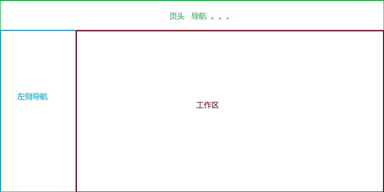

牛  2006 从事Java开发 

考虑几件事：

# 需求分析

小程序----  安阳车服  （2.0版本）

​          -----鹤壁车服  （3.0版本）

​     安阳的金融公司 （汽车抵押贷款 ）

  客户：  我们有很多车主信息，我想通过做一个平台，让我的

一批车主客户，可以实现线上优惠加油，通过口碑相传，客户推荐

客户 ，以此为手段，收集大量车主信息（），每个车主一年的目标 

挣100

假如：去油站加10L油  需要200元 

在平台上加油10L，只需要180

分析：

1. 做一个平台
2. 实现线上下单  优惠加油
3. 发展会员  
4. 会员费    
5. 每份保险挣客户20元 ....

 推荐： 小程序  

  与客户沟通好： 

下单的流程：

油站A：   

1. 平台在A站 办一张卡 10000

2. 用户在平台下单  200  ----实付180  

3. 生成一个二维码凭证  

4. 去油站加油  

5. 在支付的时候，亮出二维码，说我是车服的

6. 油站方 公众号  ----拿着手机扫描二维码 显示订单信息

   加油200  车牌号

   车主可以走了 

   油站拿着我在平台办的卡  扣200  

   手动确认订单完成 

车牌后面有一个牌子：XXXX车队

享受的：

* 去油站加油优惠 
* 洗车 保养 换零件 。。。。
* 旅游.... 

# 数据库设计

   建模软件  

   powerdesigner  

# 技术选型

分布式架构  

单体架构 

需要缓存：引入redis  

引入mq 

广州实地集团 ：

房产应用： 

* 售前系统 

  > 拓客   案场
  >
  > 前期需求分析：  2个月 
  >
  > 技术开发： 1月（时间短）
  >
  > 测试： 1~2个月 
  >
  > 产品经理：
  >
  > 绩效考核系统
  >
  >  技术开发成本： 20多W 
  >
  > 软件报价：  500W 

* 售中系统

* 售后系统 

# 原型

产品经理： 设计产品原型 

原型工具：

* axure  
* 墨刀

功能实现后的最终效果，演示 

前端： 原型   注重用户操作体验 

后端：  （要求 产品设置后端原型 ）

* 后台api开发  sprinboot  mybatis ...
* 后台管理界面  （   由后端人员来做  ）   UI库  

# 安装

官网地址：

~~~shell
https://registry.npmjs.org/
~~~

淘宝镜像：

~~~
npm config set registry https://registry.npm.taobao.org
~~~

cli安装

~~~shell
npm install -g @vue/cli
~~~

创建

~~~shell
vue create shop # 选择vue2 
~~~

# 环境准备

软件：

* jdk8    [下载](https://www.oracle.com/java/technologies/downloads/#java8-windows)

* mysql    [下载](https://dev.mysql.com/downloads/installer/)

* idea 

  > 链接：https://pan.baidu.com/s/1hwK5IDPLMEv621z8UkUGJA 
  > 提取码：n54o

* vsc  /hbuilder  

* powerdesigner

  > 链接：https://pan.baidu.com/s/1FUFD9GqB1JSnYSeSrdn_VA 
  > 提取码：9j6m

  

# 版本管理

cvs/svn  集中式管理  

git 分布式管理

# 社区团购

## 电商 

淘宝 、 京东 

自己先进货，---库存 

在网上等着客户去买  

商品积压

## 团购

通过吸引大量的用户 一起购买  ，从而使用价格美丽  （走量）

客户群体：广泛 

## 社区团购  

疫情刚开始时，封在小区 

在微信群里： 接龙购买东西    （商品好 价格低 ）

客户的范围：  面向社区的 

社区团购流程：

1. 首先，平台没有任何商品 

2. 让社区的用户下单 （先付款）  

   > 特点：
   >
   > * 价格便宜 
   > * 商品好 
   > * 第二天到货  （到你住的小区指定地点取货）
   > * 一般情况下 一个小区 一个负责人（得有存放商品的地点）,这个人称为团长（根据下单金额提成） 现实中的团长一般都是跟小区的超市或便利店合作
   > * 团长 一般都是小区业主  业主之间相互比较信任
   > * 现实中，团长已经演变成  便利店
   > * 下单提货点 一般都是合作的便利店  （普通的电商购物 发货你家或工作单位）

3. 平台根据订单  去统一采购 （量大 价格低）  用户已经付款过  （没有资金压力、也不用囤货）

4. 送货到 指定小区  由团长联系客户提货 

如：

* 多多买菜
* 美团优选
* .... 

# 任务

以组为单位 ，参考多多买菜，用word表格形式，设计数据库字典  

1. 要设计哪些表 
2. 表里面的字段有哪些 
3. 表与表之间关系   

格式：

| 字段名 | 字段类型    | 默认值 | 字段描述 |
| ------ | ----------- | ------ | -------- |
| id     | varchar(36) | ""     | 主键     |
| name   | varchar(20) | ""     | 名称     |
|        |             |        |          |

# 数据库设计

字段名称着字母缩写：  商品名称  spmc    商品价格  spjg 

ssm :  spring  spring mvc  mybatis  

## ssh :     hibernate  

 ORM框架：Object Relation Mapping  对象关系映射框架  

 设计持久类： 一个类对应一张表   （类名与表名、类的属性的名与表的字段名一一对应）

 操作持久类： crud 都是直接操作持久类的 

面向对象的思想设计 

概念模型-----> 持久类-  ---映射文件 (xml)--（方言：使用的数据库 mysql）---hibernate的映射工具直接生成数据库 

实际过程： 先设计表 然后使用逆向工程  生成持久类及映射文件  

## MyBatis

半自动化的ORM  ,  让用户自己写sql语句（动态sql ）,查询结果 时根据我们的配置自动转换成javabean 或map  

MyBatis-Plus 

​     在Mybatis基础上封装了常用api，然后实现实体类的CURD    

## 社区团购

  E-R图  外键约束 ....

思考： 

1. 你一次只购买一个商品吗？  可以购买多个 
2. 付款的时候  是一个商品一个商品的付吗？  不是  一次性付的 

下单： 要记录  这次购买的总价格 购买人 提货信息 。。。

还要记录  购买了哪些商品、购买时的价格、购买的数量  。。。。

### 会员 

   第一次访问电商小程序，现在还让你注册吗？

   答案：NO  

   会员信息收集的过程：

1. 当你首次访问时  会弹出对话框 

   XX应用要获取你的昵称和头像？是否允许  

2. 当你下单时 

     判断你是否是会员，如果 是。。。。直接下单

     如果不是：

   XX应用要获取你的昵称和头像？是否允许  

   * 不允许  不让下单  

   * 允许  

     > XX应用要获取你的电话号码？是否允许  

### 主键

* 选择 自动增长    数字类型  
* varchar(36)   uuid  
* 雪花算法  产生一个数字 

### 字段命名

统一使用 小驼峰命名法 ：  

字段由多个单词组，第一个单词首字母小写，其它单词首字母大写 

### openid

一个微信账号对应一个小程序或公众号 ，都有一个唯一的id与之关联，且id唯一  

用户在访问小程序或公众号时，可以获取到这个id,  根据id查询会员信息：

如果查到，说明已经是会员，返回会员信息，如果不存在，返回null

### 关于删除

  分为逻辑删除和物理删除

* 物理删除  真正的删除  delete  from ...
* 逻辑删除   通过一个字段标识  数据是否删除  如  isdel  0 否 1 是 

### 通用字段

  在阿里巴巴开发手册中，推荐在每一张表中增加两个字段：

* 创建时间   
* 更新时间 

在mysql数据库，可以自动获取 。在实际操作中，可以当这两个 字段不存在，交由mysql数据库自动维护

### 字典表

 存放系统中，所有动态变化的参数（数量比较少，不宜建一张表）

如： 所属行业   门店数量  ...

### 评论

    1. 针对商品的评论 
    1. 针对评论的回复  

​       回得的内容，回复的时间 回复人   评论id

如果允许用户针对回复再回复？

#### 评论晒图

   怎么做？

​    再建一张  评论图片表 ！！！

   思考：  评论的图片  和商品的图片 有什么区别？（数据库设计上 ）

​    能否合并，使用同一张表呢？

​     答案：可以   ，  只需要在表中增加一个类型字段  区别什么类型的图片 

### 多级设计

一级类别：父id  为0  

粮油： id===001

> 二级类别：
>
> 食用油：  201  ----pid=001
>
> > 三级类别：  
> >
> > 调制油： 301 ---pid=201
>
> 大米： 202-----pid=001

思考问题：

还有哪些情况 使用这种设计方式 ？

* 设计一张表存储全国的省市区？  
* 部门设计 ？  

### 商品类别

类别字段如何设计 ？

考虑问题：

大豆油  它属于 粮油  也属于食用油   (如果有更多类别，还可以属于其它更细的类别)

1. 当点击粮油时  可以查询到该商品 
2. 当点击食用油时  可以查询到该商品 
3. 当我点击更详细类别时，也可以查到....

> 前提：
>
> 粮油:  001
>
> 以下二级类别 pid=001
>
> 食用油id:  002    
>
> 大米：003

~~~sql
select * from goods where cid=002
select * from goods where cid in (select id from category where pid=001)
~~~

类别路径：

大豆油：  001/002/...

使用like模糊查询 

### 关于供应商的思考 

1. 每天卖的商品 由平台添加，有用户下单，再由平台到

   指定供应商采购，配送  （供应商随时变化）

2. 平台跟供应商合作，给供应商开通一个账号，允许供应商

   发布商品，有用户下单，供应商统一整理  交给平台配送

3. 将配送服务外包给第三方 

### 关于订单

金额：

* 应付金额   
* 实付金额  （领的有优惠券）

思考：

在订单表中  直接关联自提点  行不行？

答案：不行 

有一个自提点：

id: 001

name: 张三小卖部 

如果下单关联：   正常情况 下，查询订单的自提点  关联查询  没问题 

假如：半年以后  ，张三小卖部  转让了 ------改成---：  李四便利店

这时，我查看历史订单时：查看自提点  关联查询时，显示成李四便利店了 

这就是问题！！！！

当你下过单过后，所有数据已经成为历史！！！不可改变。。

### 关于订单明细

  要记录购买的商品 ，能否直接关联商品表？

  答案：NO 

 同样的道理，一旦下单，数据成为历史不可改变!!!!

## 要求

1. 安装好mysql数据库  （安装一个mysql客户端 ）

2. 安装好idea开发工具 

3. 前端使用vsc  

4. 有node.js环境  

5. 尝试自己设计优惠券数据表 

6. 查找资料 了解权限设计 

   > 权限分类：
   >
   > * 功能权限    不同的用户操作的功能不同 
   > * 数据权限   不同的角色查看到的数据范围不同 

7. 查询资料 了解  springboot  mybatis  druid连接池   restful api  

   

# 架构搭建

## 技术选型

ssm    spring +  spring MVC + mybatis  

* spring 是一个轻量级框架，IOC  AOP , 整合其它框架  

* Spring MVC  是一个web框架  ，处理用户的请求和响应的 核心：DispatcherServlet  

  控制层

  > 早些年：
  >
  > * struct1   ActionServlet  
  > * strutc2   -----webwork 

* MyBatis  半自动化的ORM工具 

  1. hibernate ----完全ORM  操作持久对象（CURD java类）不需要写sql
  2. 需要手写sql语句  由mybatis封装结果  （map javabean string 数字 ....）

  持久层框架    Dao数据访问层 

  

  傻瓜式相机：

  springboot  ,方便快速的搭建项目 ，重要功能：约定优先于配置 

  它提供了大量开发中常用的默认配置，采用默认的就可以直接开发。

  内嵌tomcat，直接使用

  

## MVC模型

是一种软件架构，不局限于java  

* M  model  模型 业务层  实现业务逻辑  ,调用数据访问 层 
* V   view  视图  jsp/freemarker/     显示数据的 
* C  controller控制层  接受用户的请求，调用业务逻辑model，根据结果跳 转到不同的视图上  
* Dao  数据访问层   封装了基本的CRUD  

软件设计：高内聚，低耦合      才利于扩展和维护  

面向抽象开发 （接口）

统一了接口返回数据的格式：

~~~java
    int code; //请求结果码
    String msg;//请求消息描述
    Object data;//结果
~~~

## 前后端分离

​    vue  react  

  侧重于前端，用户交互页面  。

## 搭建

### 项目结构

## Maven

[下载](https://maven.apache.org/download.cgi)

## 访问

http:  超文件传输协议  

localhost 本地地址  类似于域名  

> 正常通过域名访问 ，域名会经过DNS解析成ip地址来访问 
>
> 因为Ip地址不好记

本地的ip地址：  127.0.0.1

## Git管理

[下载](https://git-scm.com/downloads)

~~~shell
git init  #  将当前文件夹初始化为git仓库
#当你不知道怎么做时 执行下面的命令
git status  #查看状态 git 会提示你怎么操作 
#将未跟踪或改变的文件  提交到暂存区中 
git add  file1   file2.....  # file1 file2 是你要提交的文件 
#或者直接将所有改变的文件  全部提交到暂存区中 
git add .  #  .  代表所有的改变 
#提交 
git commit -m '提交的备注信息'   #将暂区中的改变提交到本地仓库

#将本地仓库关联到远程仓库上 
git remote add origin https://gitee.com/nieps/cgshop.git 
#  origin 是默认的 代表远程仓库在本地的名称  可以更改 
#https://gitee.com/nieps/cgshop.git   远程仓库的地址
git remote -v #查看关联的远程仓库 在本地的名称 及地址
#将本地仓库中的资源推送到远程仓库 
git push -u origin master  # origin 代表远程分支 master代表本地分支

#创建标签  在当前最新提交的结点  创建标签 
git tag 标签名 
#将标签推送到远程仓库 
git push origin tagname # origin 代表远程分支的名称  tagname 标签名 只推送一个标签  
git push origin --tags #将所有标签统一推送
~~~

## 数据库

~~~sql
#连接数据库
mysql -h127.0.0.1 -uroot  -p  # -h host主机  -u 用户名 -p 密码 
#查看所有数据库 
show databases;  
#第一次检查mysql是否支持中文  
show variables like '%char%';
#创建数据库
create database cgshop;
#切换到指定 的数据库
use cgshop; 
#查看当前数据库中所有的表 
show tables; 
#查看命令帮助  
help 
#执行sql脚本文件 以下两种方式都可以 
source sql脚本路径
\.   sql脚本路径
#创建账号并指定密码  cgshop是用户名  %说明任意主机都可以使用该账号连接
#数据库   cgshop1357.  密码
create user 'cgshop'@'%'  identified by 'cgshop1357.';
#将创建的数据库 cghsop权限 授权给新用户cgshop  
grant all privileges on cghsop.* to 'cgshop'@'%';
#提交
commit; 
~~~

> 软件开发时，尽量避免使用root账号 
>
> 创建新的账号

## 启动器

  springboot会自动配置，（应用程序在启动时，扫描类下面的/META-INF/）

> 2.7之前扫描：/META-INF/spring.factories 
>
> 2.7之后/META-INF/spring/org.springframework.boot.autoconfigure.AutoConfiguration.imports
>
> 官方启动器

MyBatis  

[maven仓库](https://mvnrepository.com/)

* [mybatis-spring-boot-starter](https://mvnrepository.com/artifact/org.mybatis.spring.boot/mybatis-spring-boot-starter/2.2.2)

  > ~~~xml
  >     <dependency>
  >             <groupId>org.mybatis.spring.boot</groupId>
  >             <artifactId>mybatis-spring-boot-starter</artifactId>
  >             <version>2.2.2</version>
  >         </dependency>
  > ~~~
  >
  > 

* [mysql driver](https://mvnrepository.com/artifact/mysql/mysql-connector-java/8.0.31)

  > ~~~xml
  >   <dependency>
  >             <groupId>mysql</groupId>
  >             <artifactId>mysql-connector-java</artifactId>
  >   </dependency>
  > ~~~

在项目根目录下（既pom.xml文件所在目录），执行命令

~~~shell
mvn dependency:sources  #下载源代码 
~~~

查找自动配置类：

* @EnableConfigurationProperties  启用属性批量注入  里面配置了一个XXXProperties文件  

[MyBatis中文网](https://mybatis.net.cn/)

#### MyBatis注解

[注解](https://mybatis.net.cn/java-api.html)

## 配置数据源

配置文件方式：

* properties  类型的文件  key=value   Properties类读取这类的文件  
* yml 配置文件  使用缩略形式配置 
  * key: value   :后面必须有空格 
  * 层级之间要用空格分开 

## 统一访问数据结果

## 令牌验证

开发中，常见验证方式 ：

* 基础认证    每次访问接口传递用户名和密码 （不安全）
* session(服务器)/cookie（客户端）认证  会话技术 
* token 验证 （加密过的字符串）

所有的接口统一前缀： 

* v0  v1 
* api 

## 请求方法

* get请求 

  > 特点：
  >
  > 1. 参数会显示在地址栏里 如  url？参数名=参数值&参数名=参数值....
  >
  > 2. 由于地址栏长度有限制  ，不可能使用get请求传递大量数据 
  >
  >    > 1. IE浏览器对URL的长度现限制为2048字节
  >    > 2. 360极速浏览器对URL的长度限制为2118字节
  >    > 3. Firefox(Browser)对URL的长度限制为65536字节
  >    > 4. Safari(Browser)对URL的长度限制为80000字节
  >    > 5. Opera(Browser)对URL的长度限制为190000字节
  >    > 6. Google(chrome)对URL的长度限制为8182字节
  >
  > 3. 不能传递敏感数据 

* post请求

  > 特点：
  >
  > 1. 数据以form-data形式传递，参数不会显示在地址栏，理论上来说传递参数的长度不受限制  

## 逻辑删除

   所谓逻辑删除就是在表中增加一个字段，标识 为删除标记，删除只是更改标记的值 。

注意： 使用了逻辑删除 ，所有的查询 都要加上逻辑删除字段，只查询未删除的数据

## 分页

* 总记录数 
* 每页记录数 
* 当前第几页 

mysql分页：

select * from 表名   limit  begin,size   

* begin  从第几条记录开始查询 

  >  假如：每页10条记录
  >
  >  1------0~9
  >
  >  2----- 从第10条开始查询   10~19
  >
  > 3-----从第20条开始查询    20~29
  >
  > 找规律：
  >
  > （page-1）*pageSize  

* size 每页的记录数 

# 后台管理

## 项目搭建

cli安装

~~~shell
npm install -g @vue/cli
~~~

创建

~~~shell
vue create cgshop_manage # 选择vue2 
~~~

## 引入ElementUI

[ElementUI](https://element.eleme.cn/#/zh-CN/component/installation)

~~~shell
npm i element-ui -S   #安装包
~~~

## 安装路由

~~~shell
npm install vue-router
~~~

> ~~~shell
> npm view 模块 version #查看当前版本
> npm view 模块 versions  #查看 历史版本 
> ~~~
>
> 

前端： node.js掌握 的很熟  

后端： 更适合 牛人     全栈开发 

## 后台主页

100%高设置注意事项：要求设置100%高的元素 ，其所有父辈元素的高也是100%,包括html body  

## CORS

[cors](https://blog.csdn.net/qq_45335128/article/details/111880147)

### 同源策略

同源策略：是指协议，域名，端口都要相同，其中有一个不同都会产生跨域

http://localhost:8080

作业：

1. 实现今天讲过的内容   
2. 组内分工 要求一个组内 有前端人员，后端人员  
3. 尝试实现删除功能 

## 网络请求库封装

  es6:   模块  -----  一个独立的js文件   

​    通过export 输出接口  import输入接口 

export default 输出的接口，用户在导入时可以任意命名

> node.js中  CommonJs规范  ,模块（每个js文件都有一个模块对象module）  moudel.exports  

API中常用方法：

* get     读取 资源  
* post  创建资源  
* put  更新资源  
* delete 删除资源  

js中对象：一组属性的无序集合 k-v对  键值对  ，k是字符串，值可以是以下类型：

* 字符串
* 数字  
* 布尔 
* 对象 
* 数组
* 函数(json对象不包含)

Js对象原型， Prototype ,原型上的属性称为实例属性，原型上的方法称为实例方法，必须通过实例调用 （类似于java中的成员变量或成员方法）

## 异步函数

*  async 将函数声明为异步函数
* 在异步函数中  就可以使用await 等待异步请求的结果  

## 关于路由

添加到Vue上的实例属性：

* $router  路由对象   可以实现导航 。。。
* $route  包含路由信息  如参数 

   传递参数：

* query   将参数显示在地址栏里  

  > 适用方法：
  >
  > 1. 路径路由  {path:"", query:{}}
  > 2. 命名路由  {name:"",query:{}}

* params 传参  不会显示在地址栏   （缺点：页面不能刷新 数据会丢失）

> 只适用于命名路由 {name:"",params:{}}

作业：以组为单位，按分工，协作 实现商品的CURD,要求每个组员写一部分，不允许重复

要求：

1. 按分组 方向  自己领取 任务 （参照CURD）
2. 上报组长 汇总到助教老师  明天以自己上报的为参靠  查看每个人的完成情况 

## 客户端安装

~~~shell
npm i    #安装  
npm run dev 
~~~

## 文件上传

* apache common-fileupload  
* 基于servlet本身的上传  

附件保存在服务器，图片的路径存储在

## 订单编码

  前缀+日期+序号

  按年归零：

   dd-2022-0001
。。。。

dd-2023-0001

